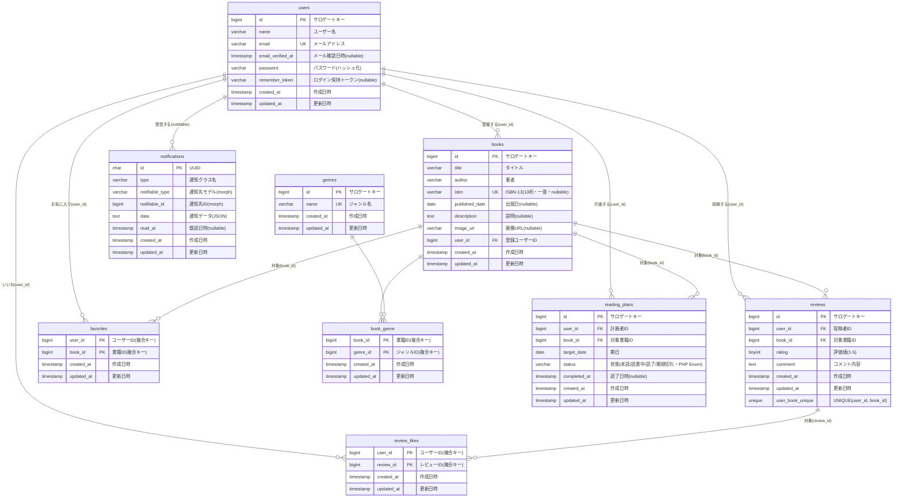

# BookShelf（本棚）

書籍を登録・閲覧し、レビュー投稿・お気に入り・いいね・ジャンル管理・評価ランキングができる書籍レビューアプリケーションです。外部アプリ向けの公開API（JSON）も提供します。

## 概要

- 書籍のCRUD（一覧／詳細／登録／編集／削除）。編集・削除は作成者のみ。
- ジャンル管理（多対多）。書籍が紐づくジャンルは削除不可。
- レビュー投稿・編集・削除（1ユーザー1書籍1件・自己レビュー禁止・投稿者のみ編集削除）。
- お気に入り（トグル）・レビューへのいいね（トグル・自己いいね禁止）。
- レビュー平均評価ランキング TOP10。
- 認証は Laravel Fortify（会員登録／ログイン／ログアウト）。
- 公開API（書籍CRUD・API Resource整形。読み取りは公開、書き込みは Sanctum トークン認証）。

### 応用機能
- 高度検索（キーワード／ジャンル／並び順。検索条件をページネーションに引き継ぎ）。
- ISBN検索（Google Books API 連携で書籍情報をフォーム自動入力）。
- マイ読書レポート（総レビュー数・読了冊数・評価分布・高評価TOP5・ジャンル別TOP5。Collectionメソッド集計）。
- 読書計画＋リマインダー通知（状態を PHP Enum で管理。日次バッチで自動失効と3タイミングのリマインダー配信・DatabaseChannel）。

## 使用技術

| 分類 | 技術 |
|---|---|
| 言語 | PHP 8.x |
| フレームワーク | Laravel 10.x |
| 認証 | Laravel Fortify（応用で Sanctum） |
| DB | MySQL 8.4 |
| 開発環境 | Laravel Sail（Docker）/ phpMyAdmin |
| フロント | Blade / Tailwind CSS / Vite / Alpine.js |
| 外部API | Google Books API（`Illuminate\Support\Facades\Http`） |
| 通知・バッチ | Notification（DatabaseChannel）/ Schedule + Console Command（日次バッチ） |
| 品質 | Laravel Pint（整形）/ PHPUnit（テスト・カバレッジ約90%）/ 型宣言・PHP Enum |

## ER図



※ reviews は (user_id, book_id) で一意。book_genre / favorites / review_likes は複合主キー。外部キーは ON DELETE CASCADE。
※ reading_plans は (user_id) ごとに自分の計画を保持。status は PHP Enum（未読/読書中/読了/期限切れ）。応用版では Fortify の `two_factor_*` カラムは未使用のため削除済み。
※ notifications は Laravel 標準の通知テーブル（UUID主キー・polymorphic な notifiable）。
※ Laravel/Sanctum 標準テーブル（`password_reset_tokens` / `failed_jobs` / `personal_access_tokens`）はドメイン関連を持たないため ER 図からは省略（DBには存在）。

## 環境構築

```bash
git clone https://github.com/takak-dev/bookshelf-app.git
cd bookshelf-app

cp .env.example .env

# 依存インストール（初回・vendor が無い場合）
docker run --rm -v "$(pwd):/var/www/html" -w /var/www/html \
  laravelsail/php82-composer:latest composer install

# 起動
./vendor/bin/sail up -d
./vendor/bin/sail artisan key:generate
./vendor/bin/sail artisan migrate --seed

# フロント
./vendor/bin/sail npm install
./vendor/bin/sail npm run dev   # 開発サーバ（常駐するため別ターミナルで起動したままにする）
```

> `.env` の DB 接続はコンテナ名を使用：`DB_HOST=mysql` / `DB_DATABASE=laravel` / `DB_USERNAME=sail` / `DB_PASSWORD=password`

初期ユーザー（シーダー投入・パスワードは全員 `password`）：
`yamada@example.com` / `suzuki@example.com` / `tanaka@example.com` / `sato@example.com` / `takahashi@example.com`

## ISBN検索（Google Books API）

書籍登録・編集フォームの ISBN 検索は [Google Books API](https://developers.google.com/books) を利用します。**APIキーは任意**で、未設定でも動作しますが、以下の既知の制限があります。

### 既知の制限：APIキー未設定だと 429 で検索できないことがある

- キー無しアクセスは送信元 IP 単位の共有クォータで判定されるため、共有環境（クラウド／社内ネットワーク等）では **HTTP 429（Too Many Requests）** で弾かれ、ISBN 検索が結果を返せないことがあります。
- アプリは通信失敗・該当なし時に安全に `null` を返す実装のため、フォームに自動入力されないだけでエラー画面にはなりません（`app/Services/GoogleBooksClient.php`）。
- テストは `Http::fake()` で外部 API をモックするため、この制限の影響を受けません。

### 解決策：APIキーを設定する

APIキーを設定するとプロジェクト単位のクォータになり、429 を回避できます。

1. [Google Cloud Console](https://console.cloud.google.com/) でプロジェクトを作成（既存でも可）
2. 「APIとサービス」→「ライブラリ」で **Books API** を有効化
3. 「認証情報」→「認証情報を作成」→「**APIキー**」を発行
4. `.env` に追記：
   ```env
   GOOGLE_BOOKS_KEY=取得したAPIキー
   ```
5. 設定を反映：
   ```bash
   ./vendor/bin/sail artisan config:clear
   ```

環境変数（`config/services.php` の `google_books`）：

| 変数 | 必須 | 既定値 |
|---|---|---|
| `GOOGLE_BOOKS_KEY` | 任意 | （なし・未設定でも動作） |
| `GOOGLE_BOOKS_ENDPOINT` | 任意 | `https://www.googleapis.com/books/v1/volumes` |

## 開発環境URL

| 用途 | URL |
|---|---|
| アプリ | http://localhost |
| phpMyAdmin | http://localhost:8080 |

## 公開API エンドポイント

ベースURL: `/api/v1`（JSON）。**読み取り（GET）は認証なし、書き込み（POST/PUT/DELETE）は Sanctum トークン認証必須**（未認証 401・他人の書籍 403）。

| メソッド | URI | 認証 | 説明 |
|---|---|---|---|
| POST | `/api/v1/tokens` | 不要 | メール/パスワードで Bearer トークンを発行 |
| GET | `/api/v1/books` | 不要 | 書籍一覧（`keyword`／`genre`／`per_page` 対応・20件/ページ） |
| GET | `/api/v1/books/{book}` | 不要 | 書籍詳細（ジャンル・レビュー含む） |
| POST | `/api/v1/books` | Sanctum | 書籍登録（登録者は認証ユーザー） |
| PUT | `/api/v1/books/{book}` | Sanctum | 書籍更新（所有者のみ） |
| DELETE | `/api/v1/books/{book}` | Sanctum | 書籍削除（所有者のみ） |

> 利用例: `POST /api/v1/tokens` で取得したトークンを `Authorization: Bearer <token>` ヘッダに付与してアクセス。

## テスト

```bash
./vendor/bin/sail artisan test
```

## 作成者

takak-dev
