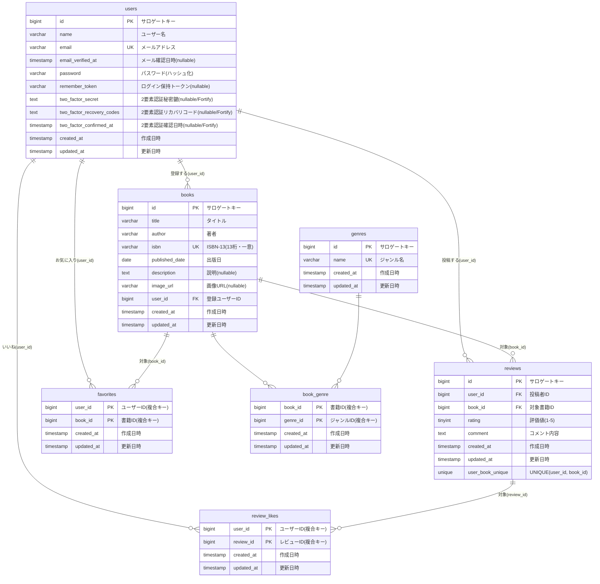

# BookShelf（本棚）

書籍を登録・閲覧し、レビュー投稿・お気に入り・いいね・ジャンル管理・評価ランキングができる書籍レビューアプリケーションです。外部アプリ向けの公開API（JSON）も提供します。

## 概要

- 書籍のCRUD（一覧／詳細／登録／編集／削除）。編集・削除は作成者のみ。
- ジャンル管理（多対多）。書籍が紐づくジャンルは削除不可。
- レビュー投稿・編集・削除（1ユーザー1書籍1件・自己レビュー禁止・投稿者のみ編集削除）。
- お気に入り（トグル）・レビューへのいいね（トグル・自己いいね禁止）。
- レビュー平均評価ランキング TOP10。
- 認証は Laravel Fortify（会員登録／ログイン／ログアウト）。
- 公開API（認証なしの書籍CRUD・API Resource整形）。

## 使用技術

| 分類 | 技術 |
|---|---|
| 言語 | PHP 8.x |
| フレームワーク | Laravel 10.x |
| 認証 | Laravel Fortify（応用で Sanctum） |
| DB | MySQL 8.4 |
| 開発環境 | Laravel Sail（Docker）/ phpMyAdmin |
| フロント | Blade / Tailwind CSS / Vite / Alpine.js |
| 品質 | Laravel Pint（整形）/ PHPUnit（テスト・カバレッジ約83%） |

## ER図



※ reviews は (user_id, book_id) で一意。book_genre / favorites / review_likes は複合主キー。外部キーは ON DELETE CASCADE。
※ users の `two_factor_*` 3カラムは Fortify 標準（基本機能では2要素認証フローは未実装）。
※ Laravel/Sanctum 標準テーブル（`password_reset_tokens` / `failed_jobs` / `personal_access_tokens`）はドメイン関連を持たないため ER 図からは省略（DBには存在）。応用機能（読書計画・通知）のテーブルは Phase2 で追加。

## 環境構築

```bash
git clone <repository-url>
cd bookshelf-app

cp .env.example .env

# 依存インストール（初回・vendor が無い場合）
docker run --rm -v "$(pwd):/var/www/html" -w /var/www/html \
  laravelsail/php82-composer:latest composer install

# 起動
./vendor/bin/sail up -d
./vendor/bin/sail artisan key:generate
./vendor/bin/sail artisan migrate --seed

# フロント
./vendor/bin/sail npm install
./vendor/bin/sail npm run dev   # 開発サーバ（常駐するため別ターミナルで起動したままにする）
```

> `.env` の DB 接続はコンテナ名を使用：`DB_HOST=mysql` / `DB_DATABASE=laravel` / `DB_USERNAME=sail` / `DB_PASSWORD=password`

初期ユーザー（シーダー投入・パスワードは全員 `password`）：
`yamada@example.com` / `suzuki@example.com` / `tanaka@example.com` / `sato@example.com` / `takahashi@example.com`

## 開発環境URL

| 用途 | URL |
|---|---|
| アプリ | http://localhost |
| phpMyAdmin | http://localhost:8080 |

## 公開API エンドポイント

ベースURL: `/api/v1`（認証なし・JSON）

| メソッド | URI | 説明 |
|---|---|---|
| GET | `/api/v1/books` | 書籍一覧（`keyword`／`genre`／`per_page` 対応・20件/ページ） |
| GET | `/api/v1/books/{book}` | 書籍詳細（ジャンル・レビュー含む） |
| POST | `/api/v1/books` | 書籍登録 |
| PUT | `/api/v1/books/{book}` | 書籍更新 |
| DELETE | `/api/v1/books/{book}` | 書籍削除 |

## テスト

```bash
./vendor/bin/sail artisan test
```

## 作成者

taka-dev
